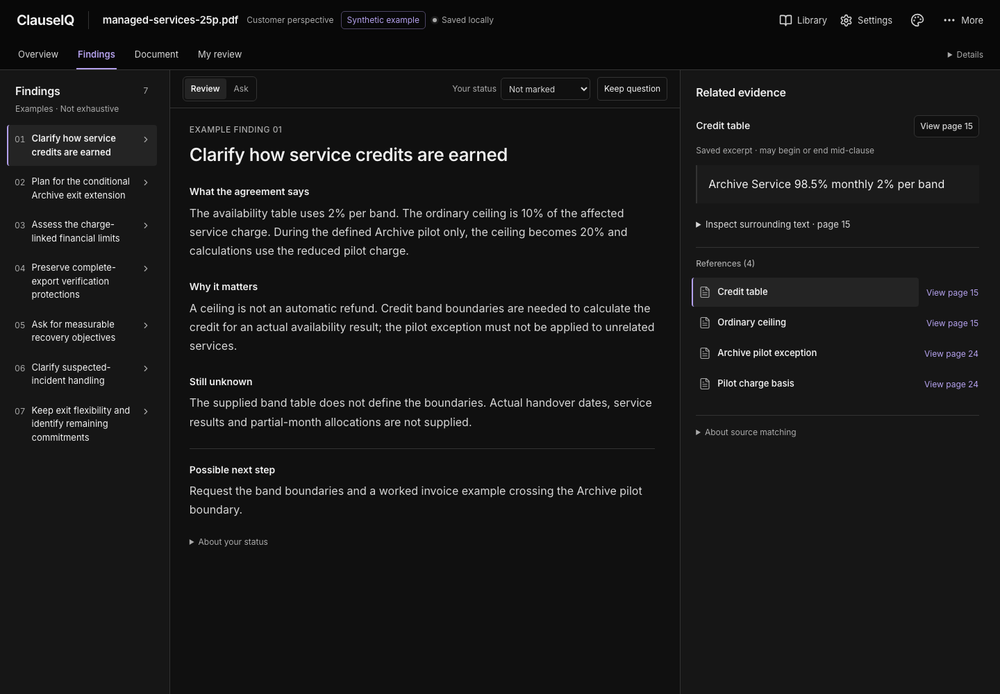
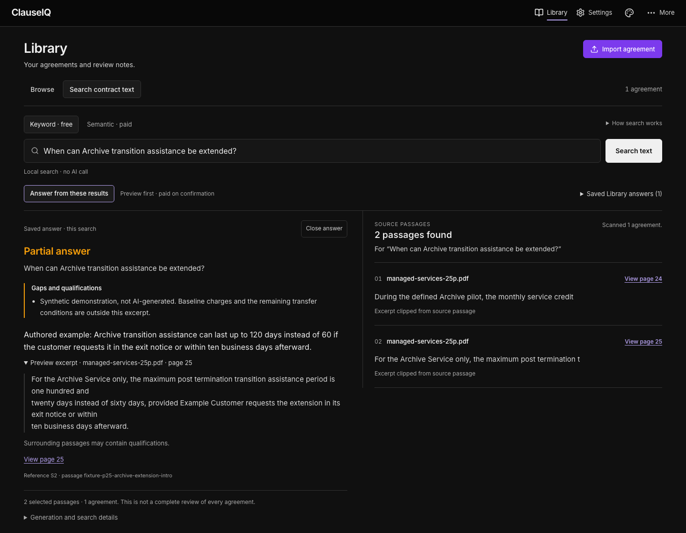
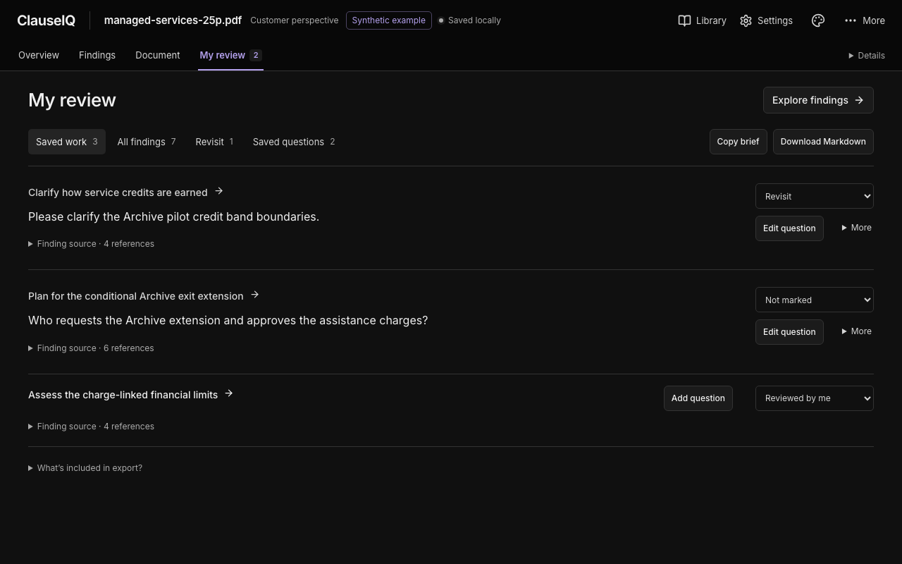

# ClauseIQ

A local contract-review workspace that keeps the agreement, its findings and your
questions together. Import a PDF, inspect evidence in the original document, and
turn the review into a short list of questions to raise.

Built as a single-person workspace with no accounts or administrator setup.
Importing, reading and saving personal work are local actions. AI reviews and
answers use your own OpenAI key through explicit requests; there is no
application-funded service or supported hosted deployment.

> Experimental engineering project, not legal advice. AI can miss material terms
> or misinterpret them. A matched citation locates source wording; it does not
> establish correctness or a complete review.

## The workflow

*All three screenshots show the actual UI with authored synthetic data and mocked
API responses—not live AI results. [Capture method](docs/images/README.md).*

1. **Import an agreement.** Keep the original PDF and page-aware extracted text;
   inspect missing-text limitations before reviewing.
2. **Review with evidence.** Choose your perspective, then explicitly generate a
   summary and findings. Preview an excerpt beside its finding and open its
   physical PDF page.
3. **Ask and decide.** Ask a finding-grounded follow-up, keep your own question,
   or mark a finding to revisit. Drafts, AI answers and confirmed questions stay
   separate.
4. **Take your work with you.** Resume your reading position and export confirmed
   questions and markers as a Markdown review brief.

*A partial answer with its own source excerpt and visible gaps.*

Search agreement text across the Library with free, local **Keyword** search or
optional paid **Semantic** search over explicitly indexed agreements. Both return
passages with PDF page links. **Answer from these results** previews the evidence
before a separate, confirmed AI request, with statement-level source links and
visible partial or insufficient-evidence outcomes. Saved answers reopen without
sending again.

*Confirmed questions and personal markers, ready to export as a review brief.*

**Try it without an API key:** import the reviewed
[25-page synthetic agreement](tests/fixtures/pdfs/managed-services-25p.pdf) and
load its labelled, authored example. The [short walkthrough](docs/WALKTHROUGH.md)
covers source navigation, saved questions, export and optional AI actions.
Black and Graphite themes share the same workflow.

## Architecture and engineering decisions

Next.js 15, React 19 and TypeScript provide the frontend; FastAPI and Python own
processing and AI orchestration. MongoDB/GridFS stores workspace state and original
PDFs. Qdrant stores Library semantic indexes and separate legacy document-chat
vectors. Mozilla PDF.js assets are served locally for original-page reading.

The two current AI workflows deliberately use different evidence boundaries:

| Path | Evidence supplied | Request boundary |
| --- | --- | --- |
| Individual review and finding-scoped Ask | All successfully extracted source passages and the review brief; Ask also receives finding context | Explicit generation; over-budget input is rejected without silently truncating source |
| Library answers | Selected Keyword or Semantic search passages, resolved against their original sources | Search first, preview evidence, then separately confirm generation |

Review and Ask do not use top-k retrieval. Library offers a local BM25 baseline
and optional `text-embedding-3-large` / 3,072-dimension indexes and exact Qdrant
cosine search. Nothing is indexed on import; indexing and semantic queries are
explicit paid actions. Older embedding indexes require a confirmed rebuild.
Keyword remains the default, and search can miss an agreement or qualification.

- **Preserved source identity.** Original bytes and their hash are stored before
  extraction. Evidence resolves to an exact document, source revision, passage and
  physical page; stale sources cannot silently resolve to a different result.
- **Durable, separate state.** Immutable review runs retain their original context.
  Revision-checked personal drafts, confirmed questions and markers remain
  separate from AI attempts. Saved reads and same-attempt replays do not dispatch
  another paid call; uncertain outcomes stay visible, with no automatic retry.
- **Observable operations.** Content-free Library stage traces link retrieval,
  generation, usage and saved attempts without logging questions, agreement text,
  answers or credentials.

[CI](.github/workflows/ci.yml) checks deterministic backend/frontend tests, types,
lint, a production build, mocked and real-stack synthetic Chromium journeys,
backend branch coverage and reachable-history secret scanning. It needs no AI key
and does not deploy the application. See [Architecture](docs/ARCHITECTURE.md) for
service boundaries and [Security](docs/SECURITY.md) for the local trust model.

## Evaluation: measured results and limits

The recorded studies use synthetic PDFs and assistant-led assessment. They separate
retrieval, generated-answer quality and application correctness; none is an
independent legal assessment or general accuracy score.

| Checkpoint | Measured result | Limitation |
| --- | --- | --- |
| [Fresh-document retrieval](docs/evaluations/LIBRARY_QUALITY_V2.md) | Large dense search reached **95% macro passage recall@5**, versus **85% Keyword**, on 10 answerable questions across three fresh PDFs. | Retrieval recall is not answer accuracy. Dense search still missed an entire agreement in a broad question. |
| [Sol reasoning effort](docs/evaluations/LIBRARY_QUALITY_V2.md#answer-assessment) | In four fixed-evidence cases, xhigh retained all frozen qualifications; medium/high omitted one notice qualification. Median generation time was 4.67s / 9.10s / 14.76s for medium / high / xhigh. | One sample per case and effort; higher effort used more output tokens and cost more. Medium also declined a case where a useful partial answer was possible. |
| [Current-pipeline Library RAG](docs/evaluations/LIBRARY_RAG_RUNTIME_V2.md) | Eight live answers combined real retrieval, the v2 prompt, persistence and replay across two inspected PDFs. Semantic found both agreements in the correction case; both modes declined an unsupported question. | Keyword missed one agreement and returned a partial answer. Four already-inspected questions and a smaller corpus do not erase the broader retrieval misses. |

The [evaluation record](docs/EVALUATION.md) retains methods, costs, historical
comparisons and qualification errors. Exact source-reference validation checks
location, not whether a statement is supported or a review is complete.
Settings defaults to GPT-6 Sol/Medium, with Luna, Sol and Astra plus configurable
reasoning effort. Changing a setting never reruns or rewrites an earlier result.

## Run locally

Prerequisites: Node.js 24+, Python 3.13+, Docker with Docker Compose. An OpenAI API
key is needed only for AI operations.

Before starting, check whether ClauseIQ already uses ports 3000, 8000, 27017,
6333 and 6334. **Existing installation?** Keep its environment files, database
selection and credential directory. Read
[workspace continuity](docs/DEVELOPMENT.md#existing-workspace-continuity) and
[Qdrant data guidance](DOCKER.md#qdrant-versions-and-existing-stores) before changing
storage or recreating containers. If the Library or key status appears missing,
restore the original configuration; do not bypass the database-binding check.

~~~bash
cp -n backend/.env.example backend/.env
cp -n frontend/.env.example frontend/.env.local
npm ci
npm run setup
docker compose -f docker-compose.dev.yml up -d
npm run dev
~~~

Open [localhost:3000](http://localhost:3000). Add your key in Settings when needed;
do not put it in an environment file. No JWT, SMTP or account configuration is
required. API documentation is at [localhost:8000/docs](http://localhost:8000/docs).
Keep all services on loopback; do not expose this unauthenticated local workspace
through a public tunnel.

Documents stay until deleted unless you deliberately enable retention. Saved
reviews remain readable without a key. Local storage does not mean offline AI:
explicit AI requests send document content to OpenAI.

~~~bash
npm test           # deterministic backend and frontend tests; no paid AI
npm run typecheck
npm run lint
npm run check      # complete checkpoint, including the production build
~~~

Use focused checks during development; batch broader browser checks and builds at
meaningful checkpoints. See [Development](docs/DEVELOPMENT.md) for commands,
isolated storage checks and separately approved live evaluations.

## More information

- [Walkthrough](docs/WALKTHROUGH.md) — a reproducible, key-free product tour
- [API reference](docs/API_REFERENCE.md) — local access and endpoint contracts
- [Contributing](docs/CONTRIBUTING.md) and [repository policy](docs/REPOSITORY_POLICY.md)
- [Docker](DOCKER.md) — infrastructure and isolated container checks

## License

[MIT](LICENSE). Third-party dependencies retain their own licenses; PDF.js is
Apache-2.0 and its generated assets retain the upstream notices.
